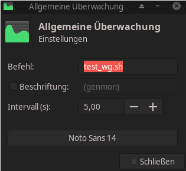

a indicator for your wireguard connection in the xfce-panel.

1. Installation

    * copy the script test_wg.sh to /usr/local/bin/test_wg.sh and make it executeable.
    it will check for a wireguard interface called wg0, if your interface is named different just change wg0 to that.
    
    * add to your xfc panel an element called xfce4-genmon-plugin
    ( https://goodies.xfce.org/projects/panel-plugins/xfce4-genmon-plugin )
    in this you can run a command like the test_wg.sh to indicate your wireguard connection is up or down.
    
    
